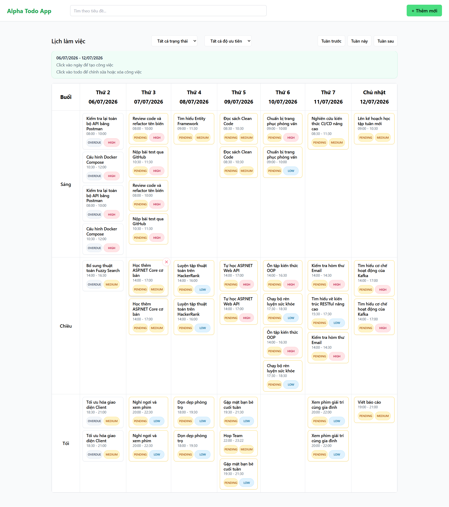
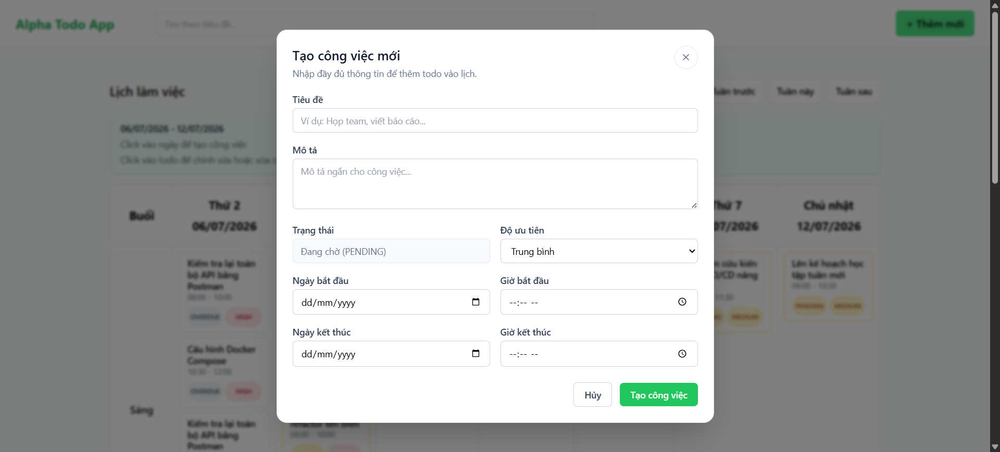
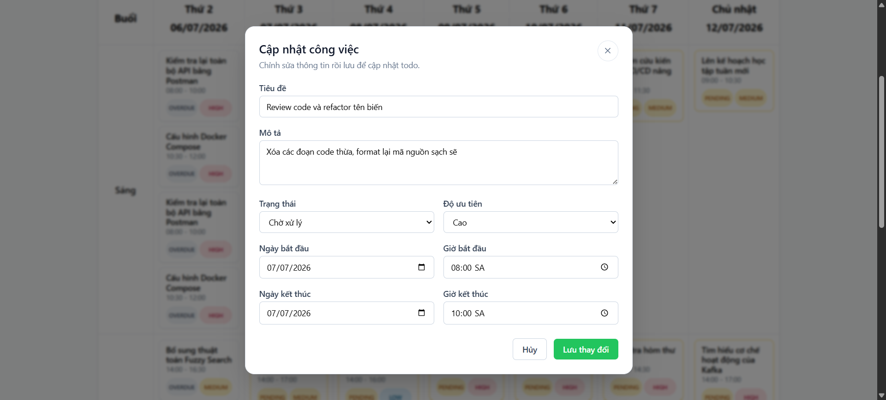

# TODO App

Ứng dụng quản lý công việc (Todo) gồm **Backend** Spring Boot + **Frontend** React (Vite), sử dụng cơ sở dữ liệu MariaDB.

---

## Tech Stack

| Thành phần | Công nghệ |
|---|---|
| Backend | Java 17 · Spring Boot 4.1 · Spring Data JPA |
| Frontend | React 19 · Vite · TailwindCSS |
| Database | MariaDB |
| Container | Docker · Docker Compose |

---

## Screenshots

### Danh sách công việc


### Tạo công việc mới


### Chỉnh sửa công việc


---

## Cách 1: Chạy bằng Extension (Thủ công)

### 1. Clone dự án

```bash
git clone https://github.com/minhtri112/Todo-App.git
cd Todo-App
```

---

### 2. Chạy Backend

**Bước 1:** Tạo file `.env` trong thư mục `backend/` (nếu chưa có):

```env
DB_HOST=localhost
DB_PORT=3306
DB_NAME=todo_db
DB_USERNAME=root
DB_PASSWORD=root
```

**Bước 2:** Chạy class `TodoAppApplication` bằng nút ▶️ **Run** trong IntelliJ IDEA.

Hoặc chạy bằng terminal:

```bash
cd backend
./mvnw spring-boot:run
```

> Backend chạy tại: `http://localhost:8080`

---

### 3. Chạy Frontend

**Bước 1:** Tạo file `.env` trong thư mục `frontend/` (nếu chưa có):

```env
VITE_API_URL=http://localhost:8080/api
```

**Bước 2:** Cài dependencies và khởi động dev server:

```bash
cd frontend
npm install
npm run dev
```

> Frontend chạy tại: `http://localhost:5173`

---

##  Cách 2: Chạy bằng Docker

### 1. Clone dự án

```bash
git clone https://github.com/minhtri112/Todo-App.git
cd Todo-App
```

---

### 2. Chạy Backend bằng Docker

**Bước 1:** Tạo file `.env` trong thư mục `backend/`:

```env
DB_HOST=<địa_chỉ_database>
DB_PORT=3306
DB_NAME=todo_db
DB_USER=root
DB_PASSWORD=<mật_khẩu>
```

**Bước 2:** Build image và chạy container:

```bash
cd backend
docker compose up -d
```

> Backend chạy tại: `http://localhost:8080`

Xem log backend:

```bash
docker logs -f todo_backend
```

---

### 3. Chạy Frontend bằng Docker

**Bước 1:** Build image và chạy container:

```bash
cd frontend
docker compose up -d --build
```

> Frontend chạy tại: `http://localhost:3000`

---

### 4. Dừng các container

```bash
# Dừng backend
cd backend && docker compose down

# Dừng frontend
cd frontend && docker compose down
```

---

## Cấu trúc thư mục

```
Todo-App/
├── .github/
│   └── workflows/
│       ├── deploy-backend.yml    # CI/CD pipeline cho backend
│       └── deploy-frontend.yml   # CI/CD pipeline cho frontend
├── backend/                      # Spring Boot API
│   ├── src/
│   ├── Dockerfile
│   ├── docker-compose.yml
│   └── pom.xml
└── frontend/                     # React + Vite
    ├── src/
    ├── Dockerfile
    ├── docker-compose.yaml
    └── nginx.conf
```

---

## API Endpoints chính

| Method | Endpoint | Mô tả |
|--------|----------|-------|
| `GET` | `/api/todos/week` | Lấy danh sách công việc tuần hiện tại |
| `POST` | `/api/todos` | Tạo công việc mới (status phải là `PENDING`) |
| `PUT` | `/api/todos/{id}` | Cập nhật công việc |
| `DELETE` | `/api/todos/{id}` | Xóa công việc |


